# SISOP-2-2026-IT-117

<div align="center">

# Laporan Resmi Praktikum Sistem Operasi
## Modul 2 — Process & Daemon

</div>

---

# Daftar Isi

- [Soal 1 - Kasbon Warga Kampung Durian Runtuh](#soal-1---kasbon-warga-kampung-durian-runtuh)
- [Soal 2 - The world never stops, even when you feel tired](#soal-2---the-world-never-stops-even-when-you-feel-tired)
- [Soal 3 - Angel](#soal-3---angel)

---

## Soal 1 - Kasbon Warga Kampung Durian Runtuh

*Author: NINN*

### Penjelasan

Program `kasir_muthu.c` dibuat untuk membantu Uncle Muthu mengamankan data buku hutang secara otomatis dan berurutan. Program ini mengandalkan **Sequential Process** menggunakan kombinasi `fork()`, fungsi `exec()`, dan `waitpid()`. Penggunaan `system()` dilarang.

#### Alur Sequential Process

Setiap langkah dijalankan oleh child process yang dibuat menggunakan `fork()`. Parent process wajib menunggu tiap child selesai menggunakan `waitpid()` sebelum melanjutkan ke langkah berikutnya. Jika salah satu child gagal (exit code != 0), program langsung berhenti dan mencetak pesan error.

```c
void run_and_wait(char **args) {
    pid_t pid = fork();
    if (pid == 0) {
        execvp(args[0], args);
        exit(1); // execvp gagal
    } else {
        int status;
        waitpid(pid, &status, 0);
        if (!WIFEXITED(status) || WEXITSTATUS(status) != 0) {
            printf("[ERROR] Aiyaa! Proses gagal, file atau folder tidak ditemukan.\n");
            exit(1);
        }
    }
}
```

#### Langkah-Langkah Program

**Step 1 — Membuat folder `brankas_kedai`**

Menggunakan `mkdir -p` agar tidak error jika folder sudah ada.

```c
char *cmd1[] = {"mkdir", "-p", "brankas_kedai", NULL};
run_and_wait(cmd1);
```

**Step 2 — Menyalin `buku_hutang.csv` ke dalam `brankas_kedai`**

```c
char *cmd2[] = {"cp", "buku_hutang.csv", "brankas_kedai/", NULL};
run_and_wait(cmd2);
```

**Step 3 — Mencari data "Belum Lunas" dan menyimpannya ke `daftar_penunggak.txt`**

Karena `system()` dilarang, redirect `>` dijalankan lewat `bash -c` di dalam `execlp`.

```c
char *cmd3[] = {
    "bash", "-c",
    "grep \"Belum Lunas\" brankas_kedai/buku_hutang.csv > brankas_kedai/daftar_penunggak.txt",
    NULL
};
run_and_wait(cmd3);
```

**Step 4 — Mengompresi `brankas_kedai` menjadi `rahasia_muthu.zip`**

```c
char *cmd4[] = {"zip", "-r", "rahasia_muthu.zip", "brankas_kedai", NULL};
run_and_wait(cmd4);
```

Jika semua langkah berhasil, program mencetak:

```
[INFO] Fuhh, selamat! Buku hutang dan daftar penagihan berhasil diamankan.
```

### Output

**Kompilasi dan menjalankan program**

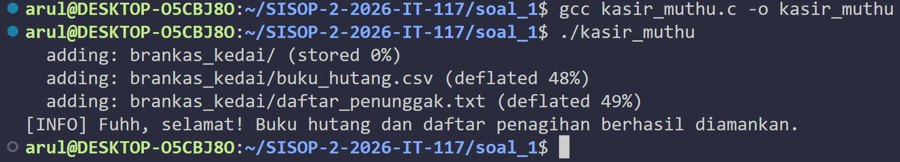

**Isi folder `brankas_kedai` (hasil `tree`)**

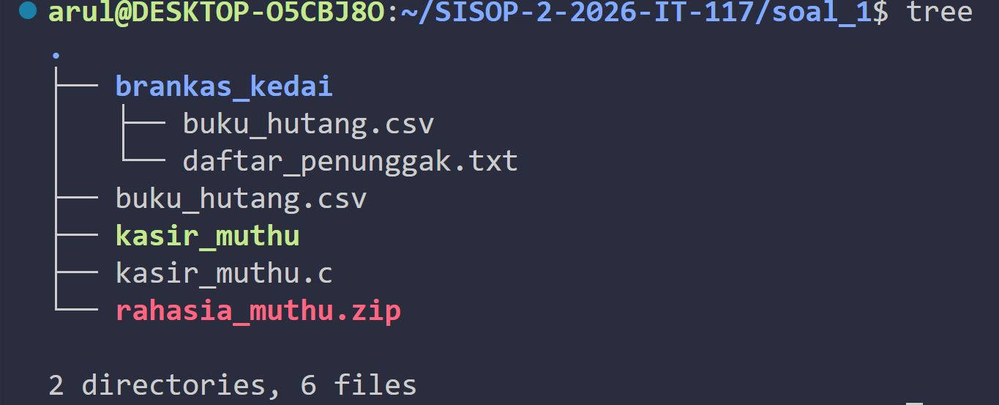

**Isi `daftar_penunggak.txt`**

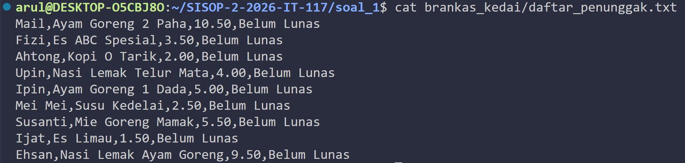


**File `rahasia_muthu.zip` berhasil dibuat**

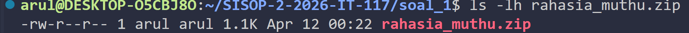


**Error handling**

.png)
.png)


### Kendala

`zip` perlu diinstall terlebih dahulu di WSL dengan `sudo apt install zip -y`.

---

## Soal 2 - The world never stops, even when you feel tired

*Author: MINT*

### Penjelasan

Program `contract_daemon.c` dibuat sebagai daemon yang berjalan di background secara terus-menerus. Program mengikuti langkah pembuatan daemon sesuai modul: **fork → umask → setsid → chdir → close fd standar → loop utama**.

#### Proses Daemonize

```c
void daemonize() {
    pid_t pid = fork();
    if (pid < 0) exit(EXIT_FAILURE);
    if (pid > 0) exit(EXIT_SUCCESS); // parent exit

    umask(0);
    if (setsid() < 0) exit(EXIT_FAILURE);

    pid = fork(); // fork kedua agar tidak acquire terminal
    if (pid < 0) exit(EXIT_FAILURE);
    if (pid > 0) exit(EXIT_SUCCESS);

    chdir(".");
    close(STDIN_FILENO);
    close(STDOUT_FILENO);
    close(STDERR_FILENO);
}
```

#### Fitur-Fitur Daemon

**Menulis log setiap 5 detik**

Daemon menulis `still working...` beserta status acak (`[awake]`, `[drifting]`, `[numbness]`) ke file `work.log` setiap 5 detik.

```c
if (now - last_log >= 5) {
    char msg[64];
    snprintf(msg, sizeof(msg), "still working... %s", statuses[rand() % 3]);
    write_log(msg);
    last_log = now;
}
```

**Membuat `contract.txt` saat daemon pertama kali jalan**

```
"A promise to keep going, even when unseen."

created at: 2026-04-07 12:00:00
```

**Monitor dan restore `contract.txt` jika dihapus**

Daemon mengecek keberadaan file setiap 1 detik menggunakan `access()`. Jika tidak ada, file dibuat ulang dalam waktu ~1 detik dengan baris kedua berubah menjadi `restored at: <timestamp>`.

```c
if (access(CONTRACT, F_OK) != 0) {
    write_contract(1); // restored
}
```

**Monitor dan restore `contract.txt` jika isinya diubah**

Baris pertama file dibandingkan dengan konten asli. Jika berbeda, daemon menulis `contract violated.` ke log lalu merestore file.

```c
} else if (!contract_valid()) {
    write_log("contract violated.");
    write_contract(1);
}
```

**Pesan saat daemon dihentikan**

Ketika daemon menerima sinyal `SIGTERM` (misalnya dari `pkill`), daemon menulis pesan terakhir ke log:

```
We really weren't meant to be together
```

### Output

**Daemon berjalan di background**

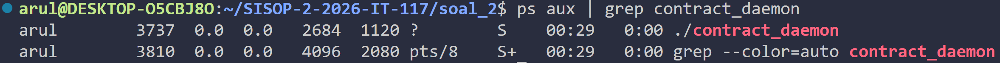


**Isi `work.log` setelah beberapa detik**

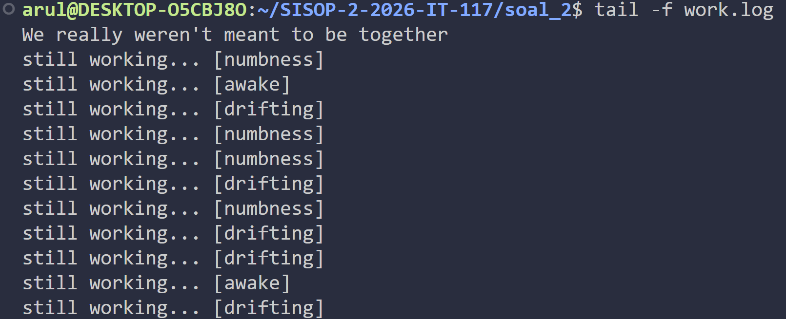


**`contract.txt` dibuat saat daemon start**

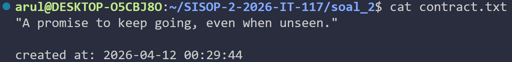


**`contract.txt` direstore**

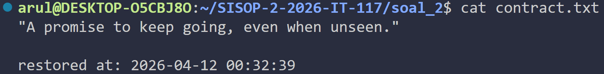


**Log "contract violated." setelah isi diubah**


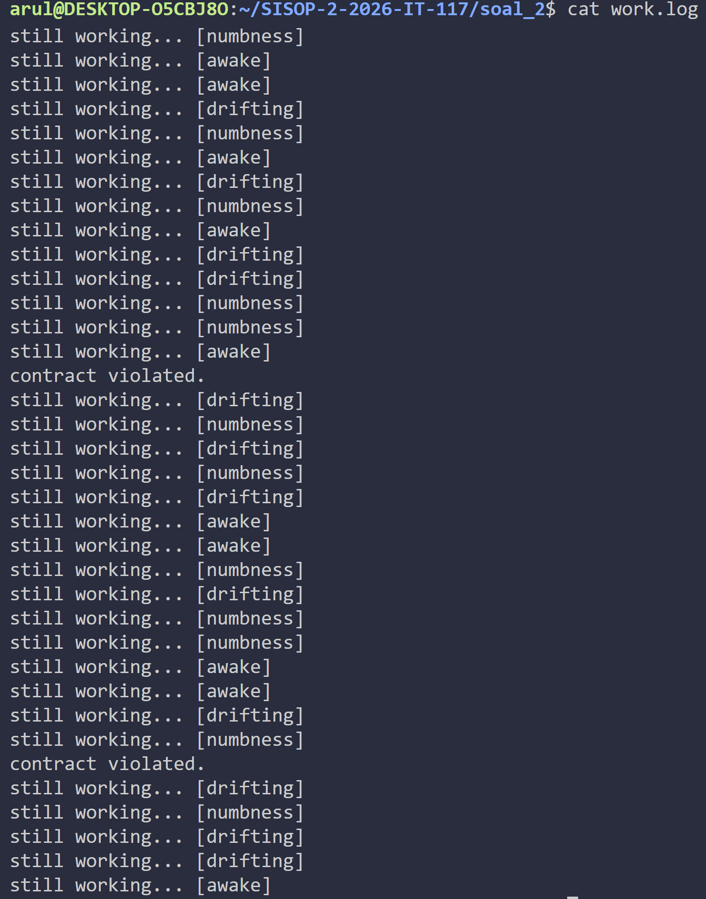


**Pesan terakhir di log setelah daemon dihentikan**


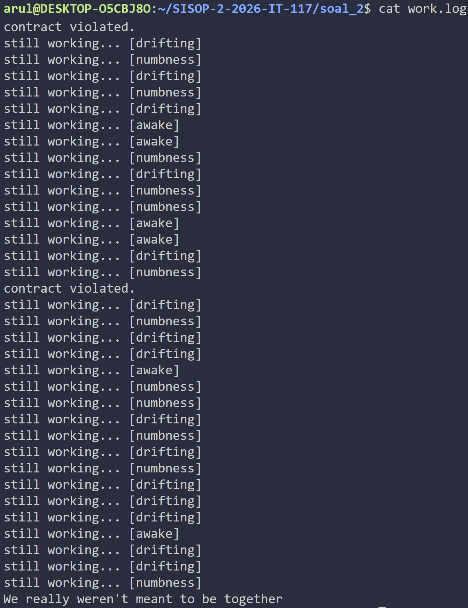


---

## Soal 3 - Angel

*Author: MINT*

### Penjelasan

Program `angel.c` adalah daemon dengan nama proses `"maya"` yang memiliki tiga mode operasi: `-daemon`, `-decrypt`, dan `-kill`. Program menggunakan proses daemonize dua kali fork sesuai modul, dilengkapi fitur enkripsi Base64 dan sistem logging.

#### Struktur Argumen Program

```
Penggunaan:
  ./angel -daemon  : jalankan sebagai daemon (nama proses: maya)
  ./angel -decrypt : decrypt LoveLetter.txt
  ./angel -kill    : kill proses
```

#### Daemonize dan Rename Proses

Setelah double fork dan `setsid()`, nama proses diganti menjadi `"maya"` dengan menimpa `argv[0]`.

```c
memset(argv0, 0, strlen(argv0));
strcpy(argv0, "maya");
```

PID daemon disimpan ke `angel.pid` agar bisa di-kill nantinya.

#### Fitur Secret — Menulis Kalimat Acak

Setiap 10 detik, daemon memilih satu dari empat kalimat secara acak dan menuliskannya ke `LoveLetter.txt`.

```c
const char *letters[] = {
    "aku akan fokus pada diriku sendiri",
    "aku mencintaimu dari sekarang hingga selamanya",
    "aku akan menjauh darimu, hingga takdir mempertemukan kita di versi kita yang terbaik.",
    "kalau aku dilahirkan kembali, aku tetap akan terus menyayangimu"
};
```

#### Fitur Surprise — Enkripsi Base64

Setelah fitur secret menulis kalimat, fitur surprise langsung mengenkripsi isi `LoveLetter.txt` menggunakan Base64 menggunakan implementasi manual tanpa library eksternal.

```c
void do_surprise() {
    // Baca isi LoveLetter.txt
    // Encode dengan base64_encode()
    // Tulis kembali hasil enkripsi ke LoveLetter.txt
}
```

#### Fitur Decrypt — `./angel -decrypt`

Membaca isi `LoveLetter.txt` yang terenkripsi, melakukan Base64 decode, dan menuliskannya kembali ke file dalam bentuk teks asli.

```c
void do_decrypt() {
    // Baca isi file
    // Decode dengan base64_decode()
    // Tulis balik hasil decode ke LoveLetter.txt
}
```

Error handling jika file tidak ditemukan:
```
[ERROR] LoveLetter.txt tidak ditemukan.
```

#### Fitur Kill — `./angel -kill`

Membaca PID dari `angel.pid` dan mengirimkan `SIGTERM` ke daemon.

```c
void do_kill() {
    FILE *pf = fopen(PID_FILE, "r");
    pid_t pid;
    fscanf(pf, "%d", &pid);
    kill(pid, SIGTERM);
    remove(PID_FILE);
}
```

Error handling jika daemon belum berjalan:
```
[ERROR] Daemon belum berjalan (pid file tidak ditemukan).
```

#### Sistem Logging — `ethereal.log`

Setiap aktivitas dicatat ke `ethereal.log` dengan format:

```
[dd:mm:yyyy]-[hh:mm:ss]_nama-proses_STATUS
```

Contoh:
```
[07:04:2026]-[12:00:00]_secret_RUNNING
[07:04:2026]-[12:00:00]_secret_SUCCESS
[07:04:2026]-[12:00:05]_surprise_RUNNING
[07:04:2026]-[12:00:05]_surprise_SUCCESS
```

Status yang digunakan: `RUNNING`, `SUCCESS`, `ERROR`.

### Output
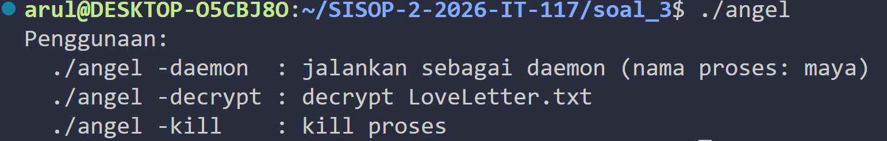
**Daemon berjalan dan nama proses menjadi "maya"**

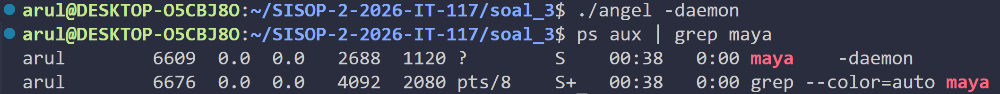


**Isi `LoveLetter.txt` dalam bentuk terenkripsi Base64**

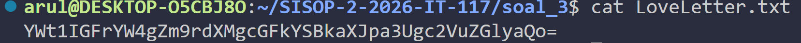


**Hasil decrypt `LoveLetter.txt`**

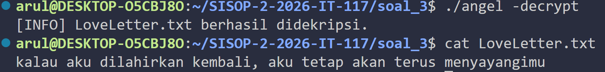


**Isi `ethereal.log`**

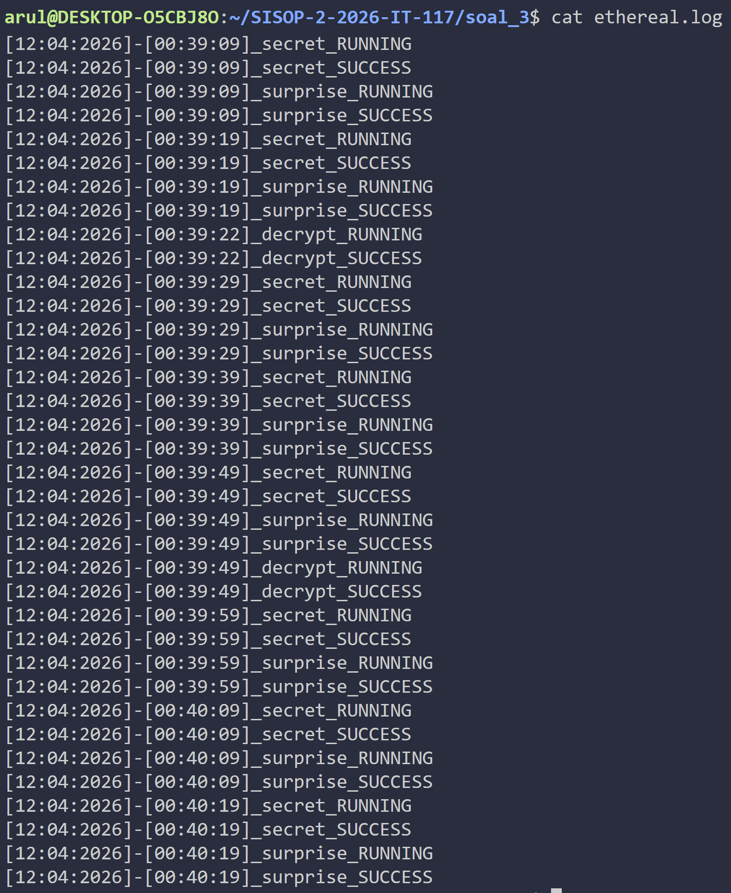


**Menghentikan daemon dengan `./angel -kill`**

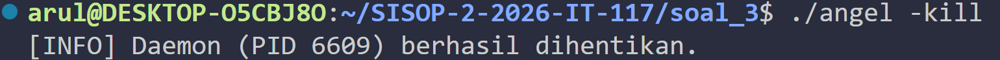


**Error handling — file tidak ditemukan**

.png)

**Error handling — daemon belum berjalan**

.png)

